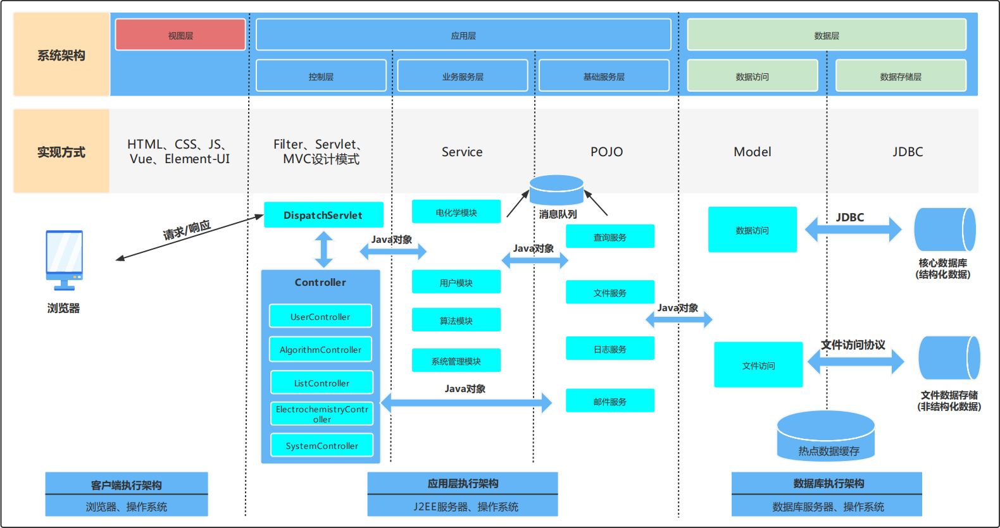
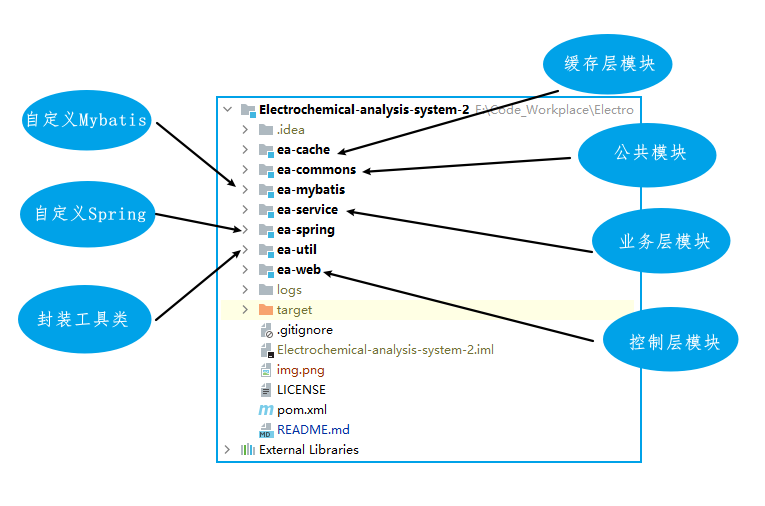

# Electrochemical-analysis-system
江西农业大学蓝点工作室计信院2019届电化学分析系统第二版。
## 项目背景与开发目标
### 项目背景
电化学分析系统是一个新系统，他与常见的电化学分析软件不同。市场上的大多数电化学分析软件都是相应的检测设备的配套软件，一般检测是分析是同步进行处理的，本系统提供在线的电化学分析服务对硬件依赖性 、可以提高检测设备的率效率、促进检测设备的专门化发展、降低检测成本。
### 开发目标
电化学分析系统旨在研发人员，摆脱硬件、地点、时间、数据的约束，本系统，提供在线实时的数据文件上传，文件保存，单曲线展示，多曲线对比，算法上传，算法选择，算法在线使用，数据保存等功能。
## 项目整体框架

## 项目模块划分

## 技术选型
- 自实现SpringMVC架构，Spring的IOC容器，自动获取封装前台表单数据，自动解析，控制层、业务层、持久层通过ioc注入，实现各层之间的解耦
- 采用JDBC自封装ORM框架，实现java对象到数据库表的映射
- 权限过滤器实现细粒度的系统身体认证和权限验证
- 使用前后端分离技术，前后端，分别部署。
- 采用本地缓存与网络缓存相结合的方式，缓存热点数据与常计算数据，缓存采用FIFO、LRU算法进行缓存策略，防止大量数据出现一次刷新掉热点数据，并大大降低数据库的压力
- 数据库连接池: 自定义
- 日志管理: slf4j + log4j2
- 测试框架: junit4 / testng
- 前端框架: Vue + Element-UI

### 日志服务
**我们将使用slf4j+log4j2的模式**

使用slf4j可以很好的保证我们的日志系统具有良好的兼容性，
兼容当前常见几种日志系统，
而使用log4j2而不是log4j是因为Log4j 1.x 在高并发情况下出现死锁导致cpu使用率异常飙升，
而Log4j2.0基于LMAX Disruptor的异步日志在多线程环境下性能会远远优于Log4j 1.x和logback（官方数据是10倍以上）。

## 项目导入
> 准备环境
- JDK8+
- Tomcat8+
- Maven3.3+
- Eclipse4.5+ / IntelliJ IDEA / MyEclipse10+
- MySQL5.7+
## 项目展示
